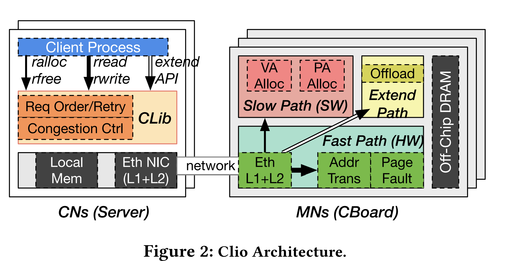

# ASPLOS'22 Clio

#### title

ASPLOS'22 Clio: A Hardware-Software Co-Designed Disaggregated Memory System

#### Take-away

总结是，一个利用HW/SW Co-design方式做的Disaggregated Memory System;

为什么要做MemDisagg:
1. 内存利用率
2. 管理方便
3. 可扩展

现有的MemDisagg的系统分为2类
1. with cores: Memory Node上是有CPU的
2. without cores: 不带CPU的MN

设计了一套新的接口，MemDisagg设计新接口也是常见的:
- ralloc/rfree
- rread/rwrite

Clio的架构图：

主要分成3个path：
1. fast path:  用于处理data access， 比如rread/rwrite：在ASIC的区域中，完成3个功能：adress translation, permission checking, page fault handling
2. slow path: 处理meta data access，比如ralloc/rfree，在ARM core上，做alloc/free
3. ext path: extended API

TODO:

设计点：
1. Scalable, Fast Address Translation
2. Asymmetric Network Tailored for MemDisagg
3. Request Ordering and Data Consistency
4. Ext and Offloading Support
5. Distributed MNs
