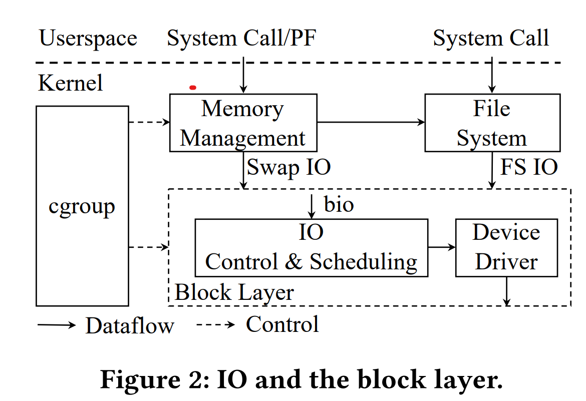
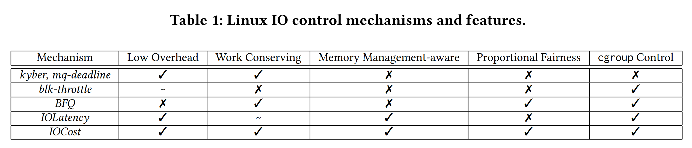

# ASPLOS'22 IOCost

### infos

ASPLOS'22 IOCost: Block IO Control for Containers in Datacenters

### takeaways

Meta针对存储场景做了一个新的IO Control/Scheduler 机制。能够更好的适应containers的场景需要。

起因是现有的Linux中的IO Control机制都无法满足Meta在生产环境中的需要，有几点challenges，也是之前的IO Control机制没做到的地方：
1. 向下考虑hardware heterogeneous。不同的存储介质，SSD，HDD，甚至不同的SSD之间都有很大的性能差距。IO Control需要考虑到不同的性能差距
2. 向上考虑不同的workload，latency-sensitive or thput. 
3. work conservation.

### IO Control在Linux全系统中的位置、和其余子模块的关系：

### Linux现有的几种IO Scheduler的对比情况

### IOCost Design