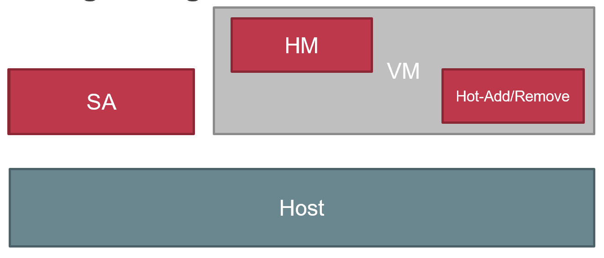

# ASPLOS'22 Memory Harvesting VMs in Cloud Platforms

##### 1. 背景和要解决的问题

云环境下，每个物理机上一般都会预留一部分资源，保证用户的workload能scale。但是这部分预留资源在大部分时间内都是闲置的。本文核心想解决的问题就是，如何利用这些闲置资源（CPU、memory等）。比如像次级债券一样，打包成新产品卖出去。

##### 2. key insight

核心的insight是之前的工作都关注在了CPU的部分，也就是Core Harvesting。而这篇工作关注了Memory的部分。其中有个数据有意思的是50%的server开销都集中在了Memory的部分。

##### 3. Challenges

1. VM Creation Time, 闲置资源重新利用的话，就会有latency的问题，导致正常VM启动变慢
2. NUMA Spanning， 闲置memory重新利用的话，可能散布在各个NUMA Node导致云性能下降。
3. Large Page Fragmentation, 回收过程可能导致大页被打散成小页。

##### 4. Design

1. batching
2. pre-reclaimation
3. buffer
4. memory hot-plug hot-removed

大概的架构如图：

1. SA = Server Agent， 当新的VM到来或者旧VM退出，SA都会先发现，并通知Host
2. Hot-Add/Hot-Remove, Host通知Guest有新的内存加入，或者需要退还内存时，都需要经过Hot-add/remove
3. HM = Harvest Manager, 当Guest加入了新的内存，或者已经退还了一部分内存，都会经过HM来通知Application，给application机会来调整自身的scale状态。

##### About the challenges

关于如何解决上述的challenges的问题，提出了一些techniques
1. Expediting Eviction
   1. 硬性通知MHVM，如果无法在ddl前交出内存，就kill (Spit it out or Kill U!!!)
2. Reserving Memory Buffer
   1. 预留buffer，不给regular vm，也不给mhvm
3. Balancing across NUMA Node
   1. 给mhvm暴露numa拓扑，并且要求mhvm归还内存时，尽可能归还相同node上的内存
4. Reclaiming Large Pages
   1. 与numa的方式相同，需要mhvm配合，要求mhvm尽可能归还连续的大页内存。