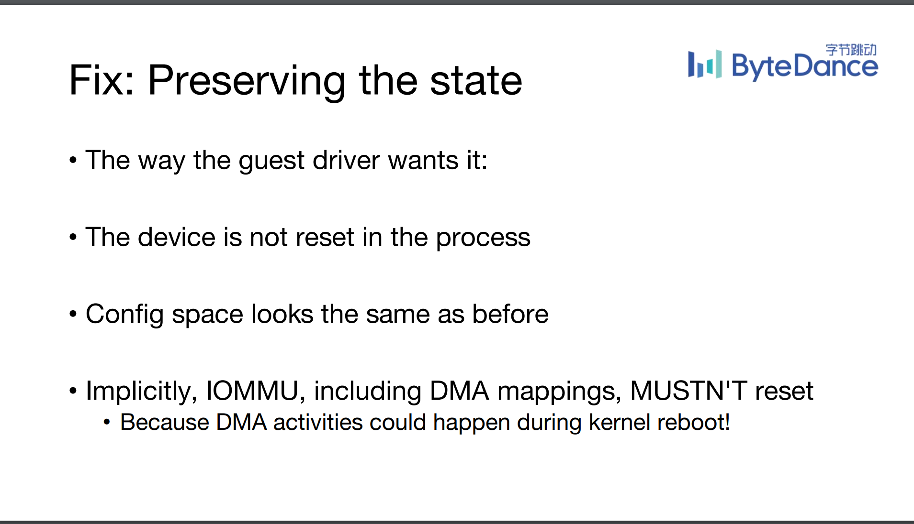
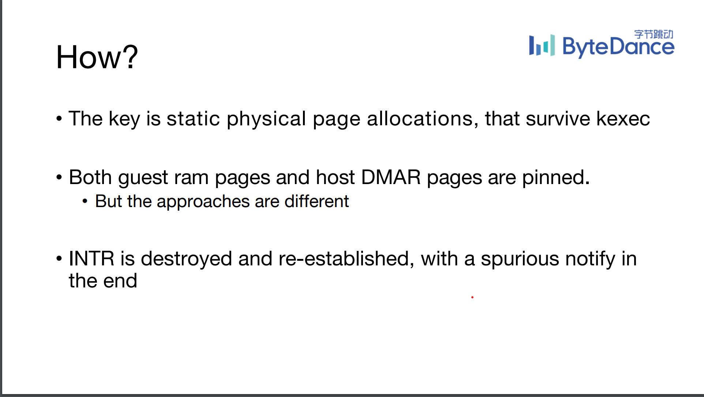

# KVM Forum 2022 中的IOMMU相关项目

## 1. Hypervisor Live Update 中 IOMMU 状态的保存

Live Update 和 Live Migration一直是云场景下关键的功能需求。
设备虚拟化技术也在逐渐从virtio类似的半虚拟化技术向设备直通技术转变。
但在当前，设备直通就无法完成Live Update和Migration的功能。
其关键点在如何保存设备和IOMMU相关的状态。

这篇字节跳动的工作就关注到了这个核心问题：如何保存IOMMU的状态。

解决方案核心：
1. 保持IOMMU页表映射不变
2. 设备的配置空间保持不变
3. IOMMU的中断映射表的保存恢复

